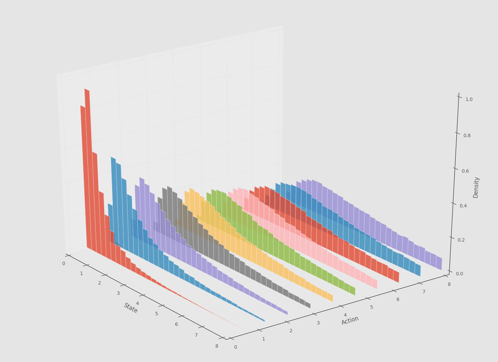

**mc-control** is a C++ library for solving stochastic dynamic optimization problems with *Monte Carlo optimal control*. It solves continuous state & continuous action problems by discretizing the continuous variables.

Example discretized probability distribution for optimal saving problem:



Example Optimal policy for optimal savings problem:


# Introduction
The library implements the two on-policy algorithms (exploring starts, sigma-soft policy) described in the 5th chapter of 

>Sutton, Richard S., and Andrew G. Barto. [*Reinforcement learning: An introduction*](http://webdocs.cs.ualberta.ca/~sutton/book/the-book.html). MIT press, 1998.

While *approximate dynamic programming* methods like *fitted value iteration* can be the logical choice for continuous state & continuous action problems, they can be unstable and hard to implement due to the several layers of approximations. The Monte Carlo control algorithms can be very useful for checking the results obtained from dynamic programming methods. Depending on the nature of the problem, the Monte Carlo methods can be a better fit compared to other reinforcement learning methods like *Q-learning* and *fitted Q-iteration*. MC methods are also less prone to violations of the Markov property and do not need a model for the dynamics, only simulations or samples from interacting with the system.

The optimization problem considered is the stochastic dynamic optimization problem of finding a policy that maximizes the expected discounted rewards over either a finite or an infinite time horizon. The finite horizon problem is 

, 

where  is a policy function,  is a discount factor,  is a reward function,  is a stochastic state variable,  is an action taken by the agent when at state , following the policy .  denotes the time period. The state variable  is assumed to be Markovian, which is why problems of this type are often called *Markov Decision Processes*.

## Curse of dimensionality
Since the algorithm works with discretized state-action space, it cannot escape the curse of dimensionality rising from having large number of state variables.

# Installation
## Dependencies
This library depends on two other libraries:

* [Armadillo](http://arma.sourceforge.net) (for matrices, vectors and random number generation)
* [Boost](http://www.boost.org/)     (for boost::irange range-based iterator)
* Python + numpy + [matplotlib](http://matplotlib.org/) for plotting

If the compiler cannot find either of the libraries, modify the [makefile](Makefile), which has variables for custom header and library search paths for these libraries (boost is header only).

## Compilation
`mc-control` is a header-only library and uses some c++11 features. Just run `make` in the root directory to compile the example consumption model. Edit the [makefile](Makefile) if armadillo or boost is not found.


# Example
A classic example for a stochastic dynamic optimization problem in economics is the neoclassical consumption model where an agent splits her income into consumption and savings and seeks the savings policy that maximizes her expected discounted utility from consumption over an infinite time horizon:


s.t.

, (feasibility constraint),

The transition function for income is


with the action  representing the amount to save, given the income.

Popular choice for the shock is log-normal distribution  For utility function, .

## Discretizing the state and action variables
To discretize the state variable , we go through these steps:

1. Draw samples from the continuous distribution of state variable
2. Divide the state space into bins and create discrete density(mass) function
3. Create inverse cumulative distribution function form the discrete density function
4. Use [inverse transform method](https://en.wikipedia.org/wiki/Inverse_transform_sampling) to sample from the resulting  discrete distribution

(Note that since we have the density function available for the state variable, instead of sampling we could use the density function directly to discretize the space.)

# Implementation details
Any model has to be derived from the base model struct:

```c++
   /*! Abstract base class for the models
    *
    */
    struct Model{

    /*! next_state = f(state, action)*/
    virtual vec transition(const vec & state, const double & action) const = 0;

    /*! Samples the transition funciton n times*/
    virtual mat sample_transitions(const double & action, size_t n) const = 0;

    /*! Reward from being in a state, taking action and ending in next_state */
    virtual double reward (const vec & state_value, const double & action_value, const vec & next_state_value) const = 0;

    /*! Returns true if it is possible to take the action from this state */
    virtual bool constraint(const double & action, const vec & state) const{
    return true;
    };
    };
```

Then one of the two episode generating functions has to be implemented:
```c++
// For soft policies
tuple<uvec,uvec,vec> episode_soft_pol(const DiscretizedOptimalGrowthModel & discrete_model,  const uvec & pol);

// For exploring starts
tuple<uvec,uvec,vec> episode_es(const DiscretizedOptimalGrowthModel & discrete_model,  const size_t & state,  const size_t & action, const  uvec & pol);
```
The episode generating functions returns a three-tuple of all actions, states and returns occurring during the episode.

For a full example implementing the optimal savings model, see [examples/optgrowth.cpp](examples/optgrowth.cpp).


<!-- Let's discretize the state  into 30 bins in the interval  and action variable  into 10 values. With 100k samples from  the discrete approximation to the state-action density looks like this: -->

<!--  -->

# The two implemented algorithms
See chapter 5. in [*Reinforcement learning: An introduction*](http://webdocs.cs.ualberta.ca/~sutton/book/the-book.html) for details.

## Monte Carlo control with exploring starts
The algorithm, reproduced from Sutton & Barto (1998) chapter 5. 


For infinite horizon problems, this algorithm reduces to randomly sampling the state-action space.

## Monte Carlo control with an soft policy (epsilon greedy)


